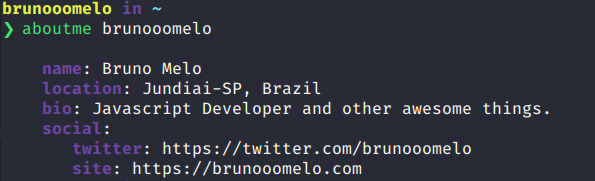

# ABOUTME CLI



> A CLI that helps you to know the social networks of a person.


### Installing

```
$ npm install -g aboutme-cli
```

### How to use

```sh
aboutme --help

  Usage:
      $ aboutme <username>     Show username and social network information

  Options:
      -h, --help            Show help options
      -v, --version         Show version
```

### Create social credencials

1. [create](https://gist.github.com/) a gist
2. write a description with a word "about"
3. and write a `JSON` with your credencials

```json
  {
    "twitter": "https://twitter.com/name",
    "facebook": "https://facebook.com/name",
    "blog": "https://blog.com/",
    "blabla": "https://blabla.com/name"
  }
```

## Contributing

Please read [CONTRIBUTING.md](CONTRIBUTING.md) for details on our code of conduct, and the process for submitting pull requests to us.

## License

This project is licensed under the MIT License - see the [LICENSE.md](LICENSE.md) file for details
